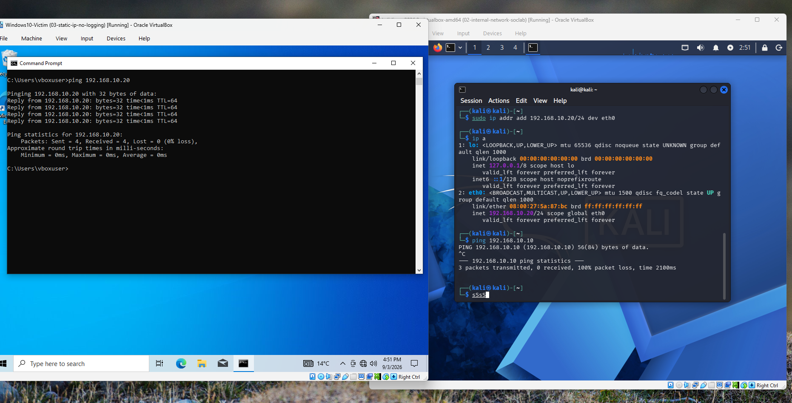
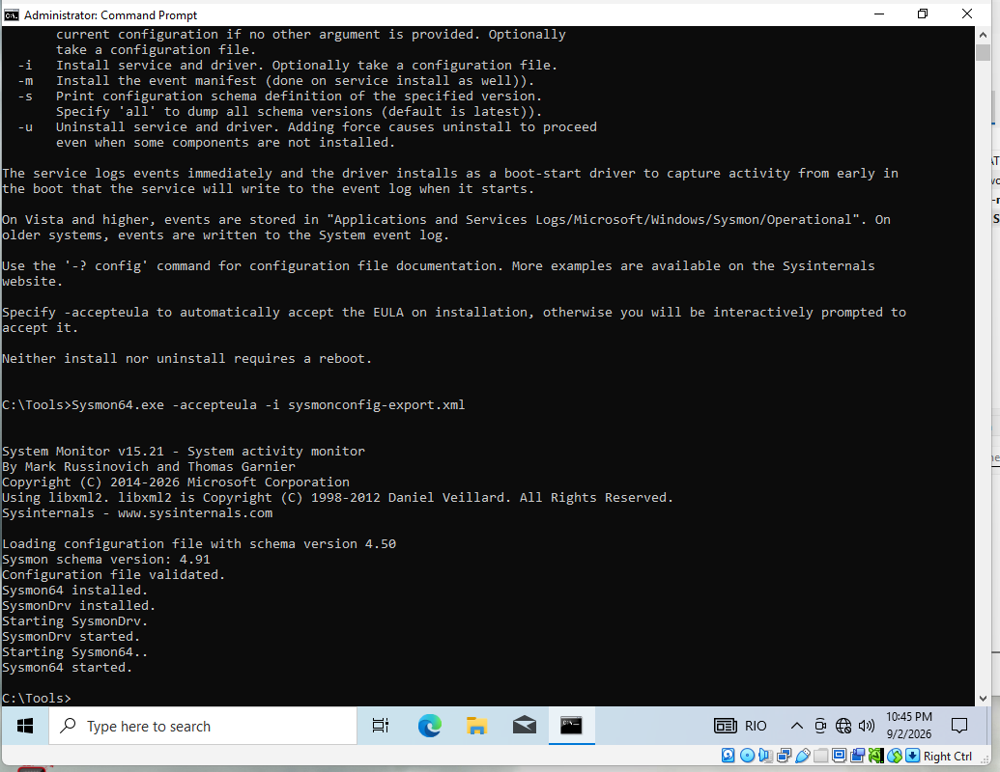
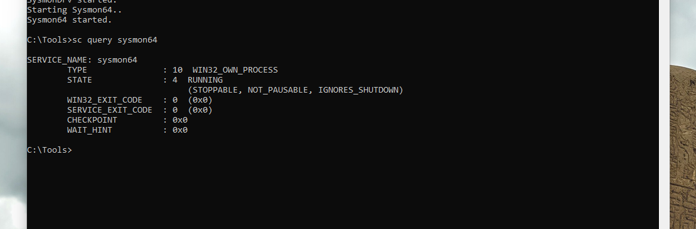
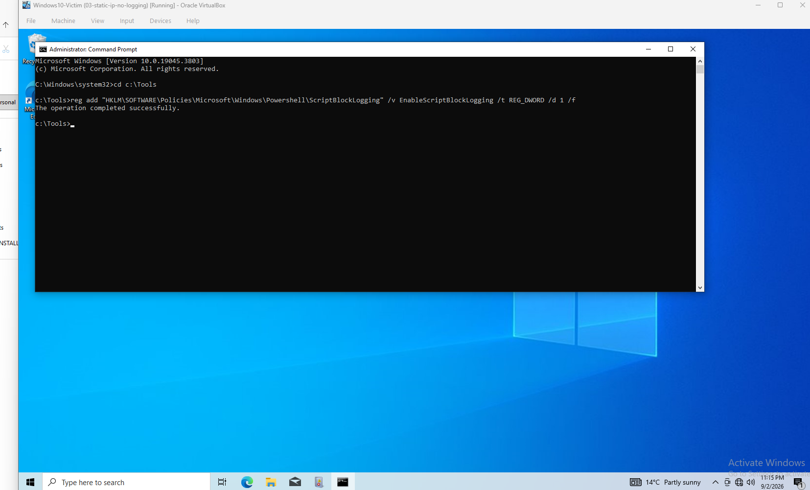
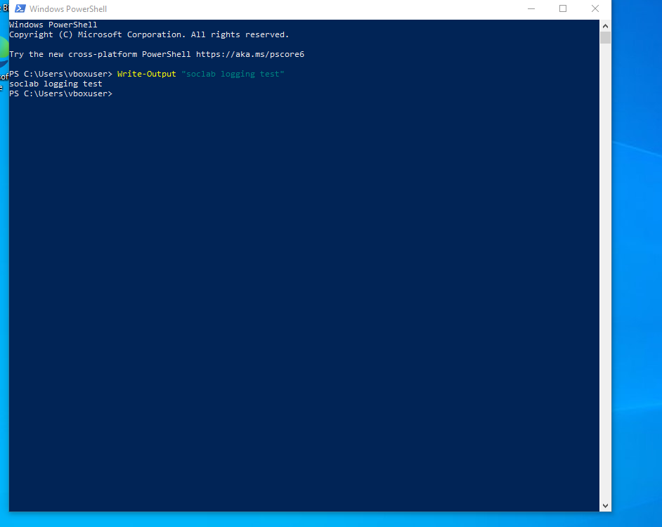
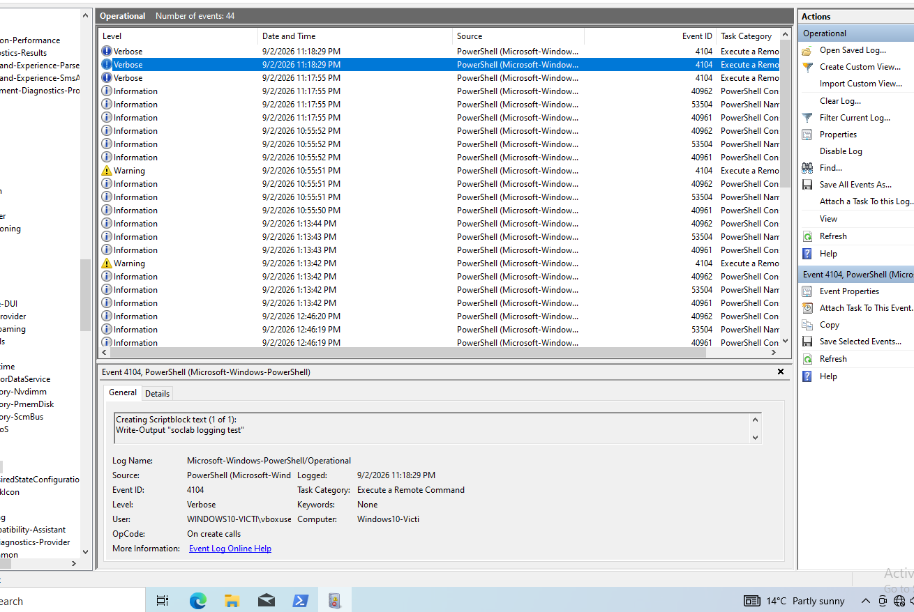
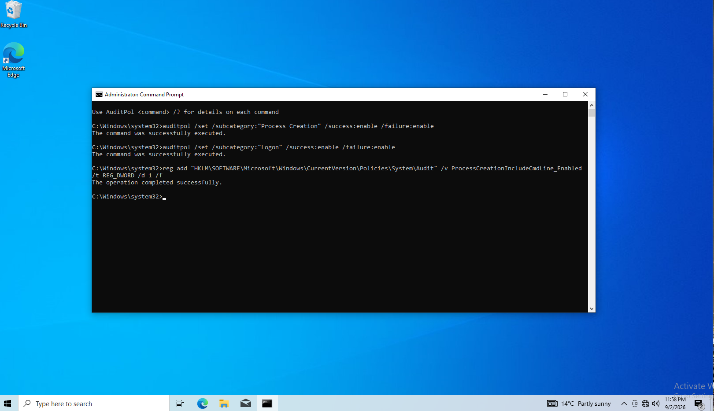
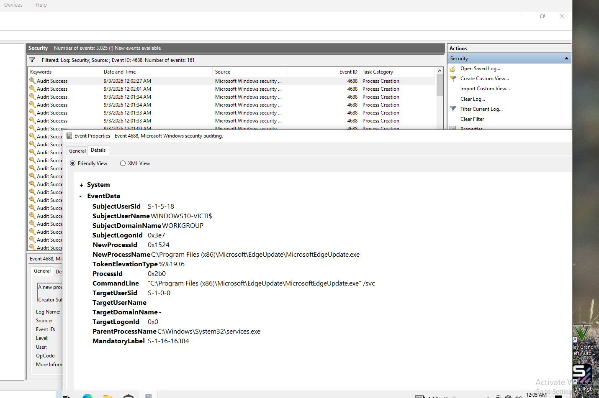

# Project 1: SOC Home Lab Build

> A documented, defensive-focused detection lab built in VirtualBox: an isolated attacker/victim network with full Windows logging (Sysmon, PowerShell script block logging, and Windows audit policy) enabled and verified.

---

## Scenario

This lab exists so I can practise detecting attacks in Windows logs, the core skill of a SOC analyst. I run attacks on purpose in an isolated environment, then look for the evidence they left behind, building the pattern-recognition an analyst uses in triage.

---

## Lab Design

Two virtual machines on an isolated internal network:

| Machine | Role | IP address | OS |
|---|---|---|---|
| Windows10-Victim | Victim (monitored) | 192.168.10.10 | Windows 10 |
| kali-linux | Attacker | 192.168.10.20 | Kali Linux |

**Network:** VirtualBox Internal Network named `soclab`. Both VMs can reach each other but nothing else, not the internet, not the home network, not the host.

Isolating the network matters here because the attacks I'm running are real and deliberately malicious. Keeping them confined to the two VMs means they can't reach my host machine, my home network, or any other devices on my Wi-Fi.

---

## Build Steps

### 1. Staged tooling while on NAT

Downloaded Sysmon (Microsoft Sysinternals) and the SwiftOnSecurity Sysmon config onto the Windows VM while it still had internet, before isolating it.

Sysmon and its config had to be downloaded before switching to Internal Network, because Internal Network has no internet access, only NAT or Bridged does. Once switched, there would be no way to download anything.

### 2. Isolated the network and set static IPs

Switched both VMs to the `soclab` Internal Network, then assigned static IPs by hand because an internal network has no DHCP to hand out addresses.

- Windows: set in adapter IPv4 properties (persists across reboots)
- Kali: `sudo ip addr add 192.168.10.20/24 dev eth0` (session-only)

**Connectivity verified:** ping from Windows to Kali succeeded (0% loss).

No response to a ping doesn't necessarily mean a host is down, since Windows blocks ICMP by default, which can look identical to a dead machine. By reversing the test and pinging from Windows to Kali instead, I got replies, which confirmed the network was working and the silence was just the firewall.



### 3. Snapshots at each stable state

Took snapshots so any state can be restored:

- `01-clean-staged-NAT` — tooling staged, still on NAT
- `02-internal-network-soclab` — switched to isolated network
- `03-static-ip-no-logging` — IPs set, connectivity verified
- `04-logging-enabled` — all logging on and verified

You snapshot a state you'd actually want to return to, so if something breaks later, restoring puts you back at a working setup rather than an earlier, unfinished one you'd have to redo.

---

## Logging Enabled (one source at a time, each verified)

Each source was enabled individually and confirmed in Event Viewer before moving to the next, so any failure could be traced to a single change.

### Source 1 — Sysmon

Installed as a service with the SwiftOnSecurity config:

```
Sysmon64.exe -accepteula -i sysmonconfig-export.xml
```

Verified the service was running:

```
sc query sysmon64      ->  STATE : 4  RUNNING
```

Confirmed events at: `Applications and Services Logs > Microsoft > Windows > Sysmon > Operational`

Sysmon adds detailed logging of process creation and network connections, which Windows doesn't record by default.




### Source 2 — PowerShell Script Block Logging

Enabled via the registry (this VM is Windows 10 Home, which has no Group Policy Editor, so the registry method was used):

```
reg add "HKLM\SOFTWARE\Policies\Microsoft\Windows\PowerShell\ScriptBlockLogging" /v EnableScriptBlockLogging /t REG_DWORD /d 1 /f
```



Ran a test command to verify logging was capturing PowerShell activity:

```
Write-Output "soclab logging test"
```



The command appeared in the PowerShell Operational log as **Event ID 4104**:



Windows doesn't record PowerShell activity by default, which matters because PowerShell is a favourite attacker tool: it's already built into every Windows machine, so no extra tool needs to be installed. Script block logging closes that gap by recording the actual commands that run.

### Source 3 — Windows Audit Policy

Enabled process-creation and logon auditing:

```
auditpol /set /subcategory:"Process Creation" /success:enable /failure:enable
auditpol /set /subcategory:"Logon" /success:enable /failure:enable
```

**Critical follow-up (the gotcha):** enabling 4688 with `auditpol` alone only shows that a program ran, not what command it used. A separate registry setting was required to include the command line, or the evidence would be nearly useless:

```
reg add "HKLM\SOFTWARE\Microsoft\Windows\CurrentVersion\Policies\System\Audit" /v ProcessCreationIncludeCmdLine_Enabled /t REG_DWORD /d 1 /f
```



Verified by opening `Windows Logs > Security`, filtering for Event ID 4688, and confirming a real event had a populated **Process Command Line** field.



**Event IDs now captured:** 4688 (process create, with command line), 4624 (successful logon), 4625 (failed logon).

---

## Findings

- The lab now captures process creation, logon events, and the command-line text used to run programs, along with PowerShell activity via script block logging.
- Learned that Windows blocks ICMP by default, so a silent ping doesn't necessarily mean a host is down.
- Learned that enabling 4688 with `auditpol` alone only shows that a program ran, not what command it used — a separate `reg add` command was needed to include the command line.
- Learned that a command saying "success" doesn't prove logging actually works — each source (Sysmon, PowerShell, and audit policy) had to be checked in its own Event Viewer log against a real event before it could be trusted.

---

## Escalation / Next Steps

This lab is the foundation for the detection projects that follow:

- **Project 2:** baseline normal activity
- **Project 3:** detect an Nmap scan (Sysmon network events)
- **Project 4:** detect malicious PowerShell (4104) — Windows Defender to be handled
- **Project 5:** detect a failed-logon attack (4625 pattern)
- **Project 6:** build an automatic detection rule (SIEM)

---

## Environment Notes

- Host: 16 GB RAM, run one VM at a time to stay within memory.
- Windows VM is Windows 10 Home (registry used in place of Group Policy).
- Kali static IP is session-only; re-applied after each reboot.
