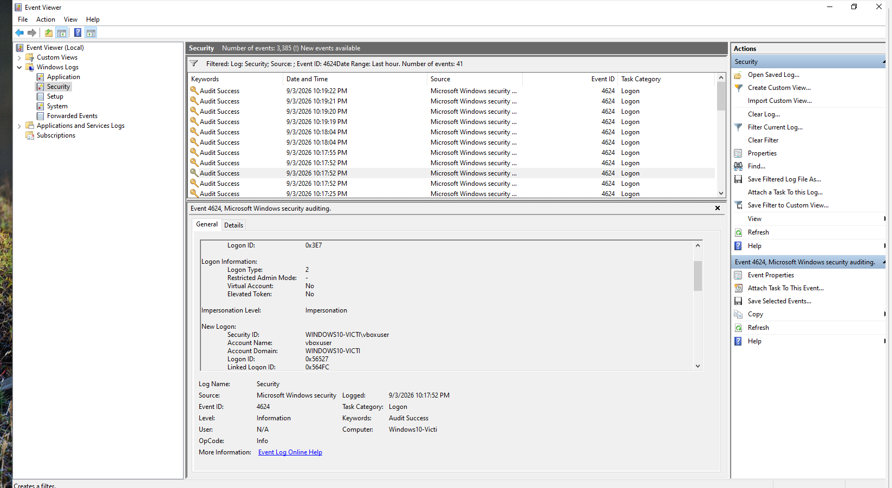
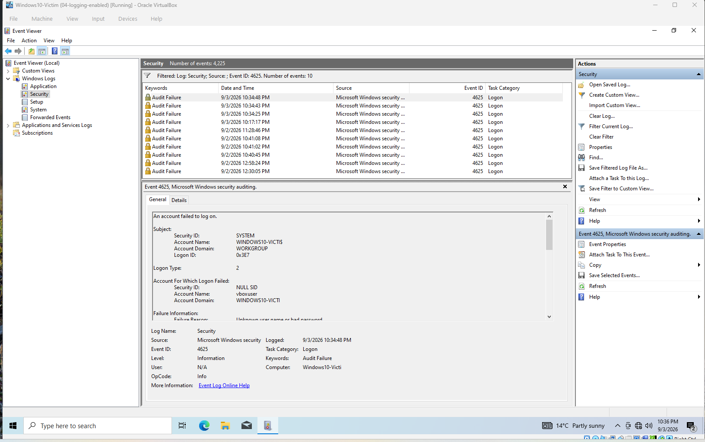
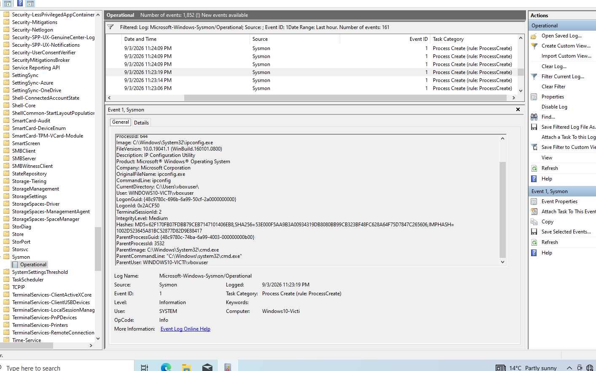
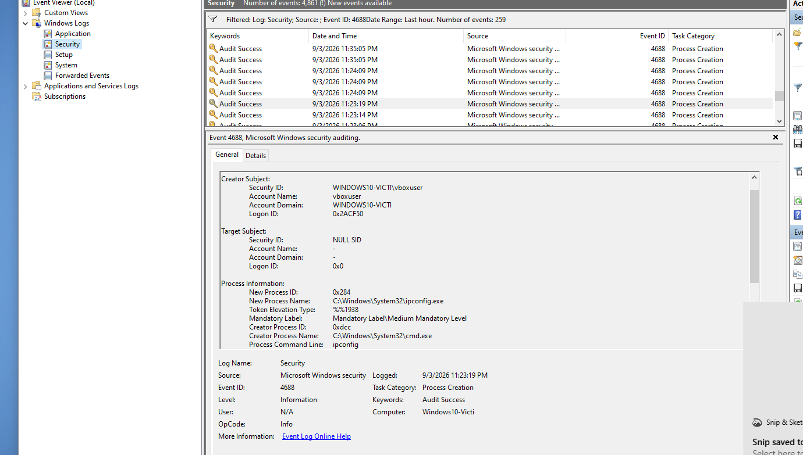

# Project 2: Baseline Normal Activity

> A defined set of normal user actions on the Windows VM, used to record what routine logon and process activity looks like in the logs before any attack is introduced.

---

## Scenario

Baselining shows what a normal activity looks like in a log on a quiet machine. Without it, you wouldn't be able to know what events are from Project 3 (the attack) or ones that happen regularly, since you would have nothing to compare them with.

---

## Baseline Actions Performed

A defined set of normal user actions was performed on the Windows VM (restored to `04-logging-enabled`) to generate a reference set of what routine activity looks like in the logs.

1. Logged off, then logged back on with the correct password
2. Logged off, then attempted logon with a deliberately wrong password
3. Opened Notepad, typed text, closed without saving
4. Opened Command Prompt, ran `whoami` and `ipconfig`, closed

I ran notepad and cmd to see the program that ran and the command line used to launch it, and with cmd specifically I could also see what launched what, like cmd launching whoami and ipconfig, which notepad doesn't show since it doesn't launch anything else. I did the logon, logoff, and wrong password to see what a normal Logon Type looks like versus a failed one, and to make sure I could tell my own interactive logon apart from a background service logon.

---

## Evidence

### Successful logon (4624)

Confirmed as a real interactive logon by checking the Logon Type field (Type 2) and the Account Name field (vboxuser), rather than trusting the first 4624 event found, since Windows also logs Type 5 service logons under the same Event ID at boot.

### Failed logon (4625)

Generated by attempting logon with a deliberately wrong password. Confirmed as Logon Type 2 (interactive attempt) with Account Name vboxuser, and Keywords showing Audit Failure.

### Process creation with parent-child chain (Sysmon Event ID 1)

Sysmon Event ID 1 for `ipconfig.exe`, showing Image, CommandLine, ParentImage (`cmd.exe`), and ParentCommandLine. This confirms Sysmon captures not just what ran, but what launched it.

### Security log vs Sysmon comparison

The Security log's 4688 event for the same `ipconfig.exe` process also shows a parent process (Creator Process Name = cmd.exe, New Process Name = ipconfig.exe), so both logs capture the parent-child relationship. The difference is depth of detail rather than presence or absence: Sysmon additionally records the exact ParentCommandLine, along with other detail 4688 doesn't capture (such as file hashes).

---

## Findings

- Learned that a real interactive logon shows Logon Type 2, not Type 5 which is a service logon, and that Event ID 4624 means success while 4625 means failure.
- Learned that a process creation event shows the New Process Name (what actually ran, like ipconfig.exe) and the Creator Process Name (what launched it, like cmd.exe), so I can trace what started what.
- I accidentally assumed a 4624 event was my own logon, but it turned out to be Logon Type 5, a service start, not a real login. I had to check the Logon Type and Account Name fields to confirm it was Type 2 and showed vboxuser before I could trust it as evidence.
- The baseline I covered was only local activity of programs run and logons, not internet traffic or browser activity or downloads, since this is an isolated network with no internet access.

---

## Escalation / Next Steps

This baseline is the reference point for the detection projects that follow:

- **Project 3:** detect an Nmap scan — anomalous Sysmon network events against this quiet baseline
- **Project 4:** detect malicious PowerShell (4104)
- **Project 5:** detect a failed-logon attack (4625 pattern) — compare a real attack's failed-logon pattern against the single 4625 baselined here
- **Project 6:** build an automatic detection rule (SIEM)

---

## Environment Notes

- VM restored from snapshot `04-logging-enabled` before starting.
- soclab has no internet access, so this baseline covers local OS, process, and logon activity only, not browser or network traffic.
