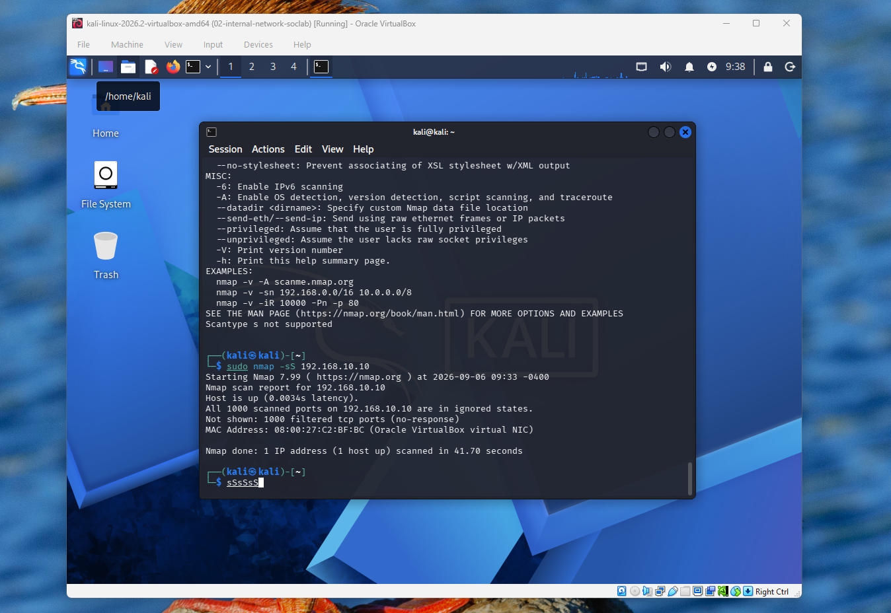
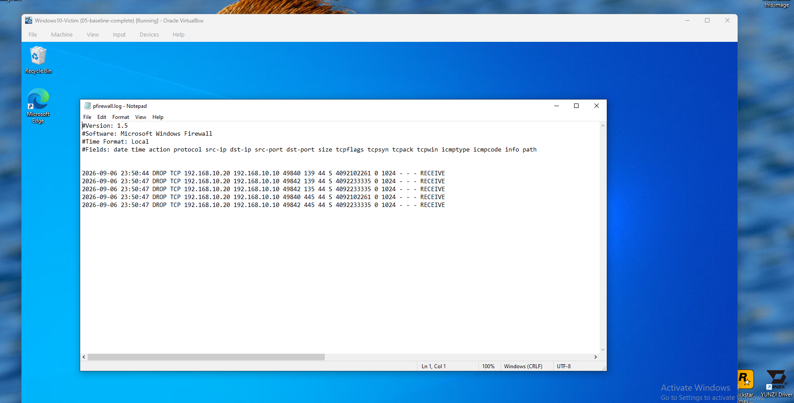

# Project 3: Detect an Nmap Scan

> An Nmap SYN scan was run from the Kali attacker against the Windows victim, then hunted down in the logs. The evidence turned up in the firewall log, not in Sysmon where I first looked.

---

## Scenario

Kali the attacker (192.168.10.20) used an Nmap `-sS` scan against Windows (192.168.10.10) to find any open ports. My task was to detect it and find the evidence of it in the logs. This matters because a scan is usually the attacker's first move, so catching a scan early means catching the intent before any real damage.

---

## Findings

First I looked in Event Viewer, in the Sysmon logs, and filtered for Event ID 3, because Event ID 3 is the network connection event, so that is where a scan would show up. Nothing showed. To make sure it was not me searching in the wrong place, I cleared the filter and saw other logs like Event ID 1 (a new process starting), so Sysmon was working fine. That meant the empty Event ID 3 was a real result, not a mistake.

Event ID 3 was empty because the firewall dropped the packets before any program on Windows handled them, and Sysmon only logs a connection when a program handles one. So there was nothing for it to record.

Since Sysmon could not see it, I knew the firewall itself saw the whole scan. So I went to Windows Defender Firewall, checked the Public profile was active, went into Logging and set "log dropped packets" to Yes, and noted where the log file lives. Then I ran the scan again so the firewall would write it down.

From Kali's side the scan came back with all 1000 ports "filtered (no-response)" - the firewall dropped every probe without replying, so Nmap could not find a single open port.

I opened the firewall log file (`pfirewall.log`) and the evidence was right there. It showed Kali (192.168.10.20) as the source sending TCP packets with the SYN flag (`S`) towards Windows (192.168.10.10), and the firewall DROPPED every packet. It also showed Kali hitting multiple different ports (135, 139, 445) in seconds, which means it was checking which ports are open. That spread across ports is what makes it a scan and not a normal connection - a normal connection uses one service, a scan knocks on many.

---

## Escalation / Next Steps

The scan did not get into the machine - every port was filtered and the firewall blocked all of it, so nothing got inside. So it is low severity: it is just reconnaissance, not a break-in. The right move is to document the scan and keep an eye on the source (192.168.10.20), not raise an alarm. It would only get escalated if that source came back and turned into a real attack, like repeated login attempts or trying to exploit a service.

---

## Environment Notes

- Windows VM sitting on the post-baseline snapshot (`05-baseline`); a new snapshot `06-firewall-logging-enabled` was taken after enabling firewall drop logging.
- Scan run from Kali: `sudo nmap -sS 192.168.10.10`.
- Firewall drop logging was enabled on the active (Public) profile; the log lives at `%systemroot%\system32\LogFiles\Firewall\pfirewall.log`.
- Key takeaway: Sysmon Event ID 3 only records a connection a program handles, so a scan the firewall drops leaves no Sysmon event - endpoint process logging is blind to a scan of a firewalled host, and the firewall log is where it shows up.
- The two VMs' clocks did not match, so events are correlated by source IP and the burst pattern, not by matching timestamps.
