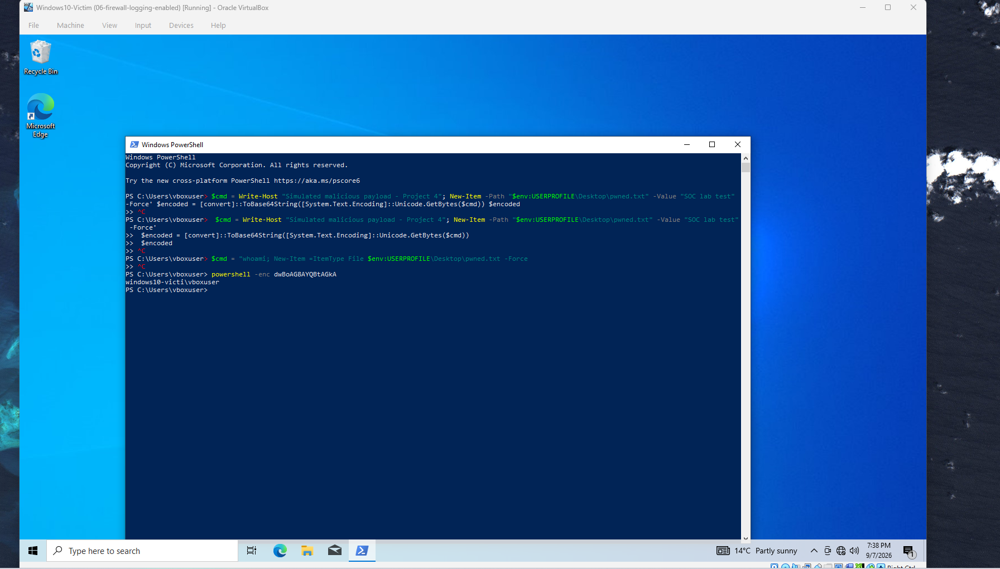
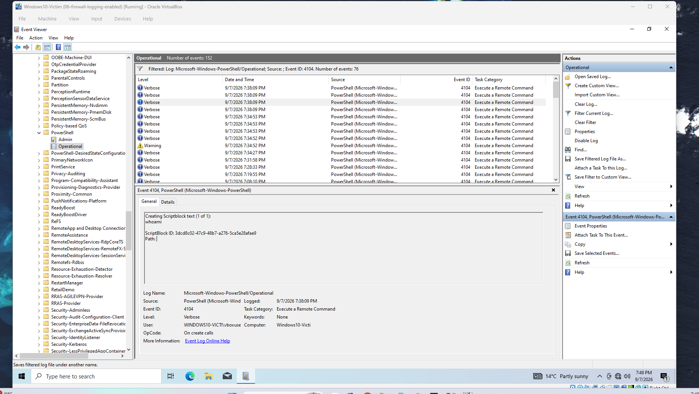
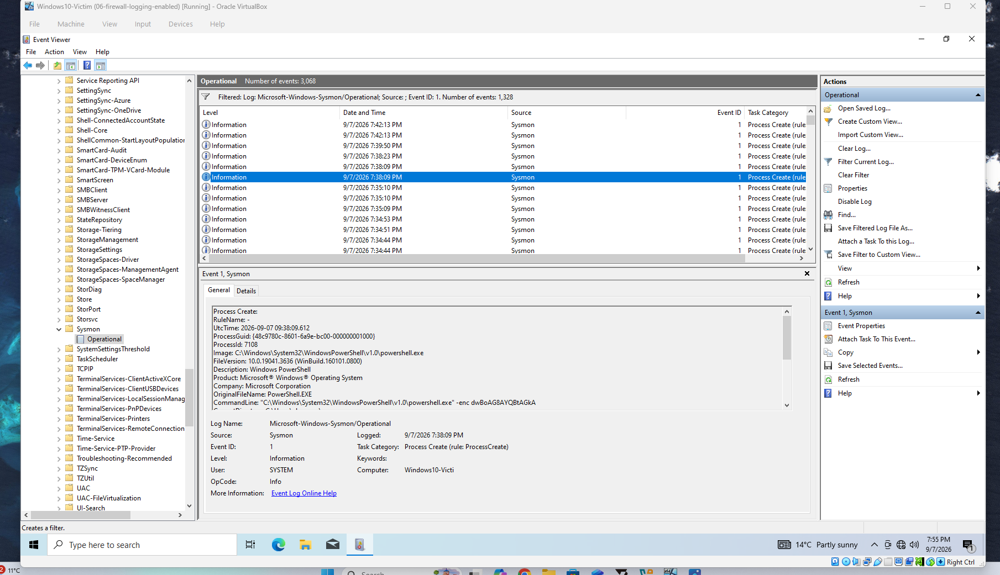
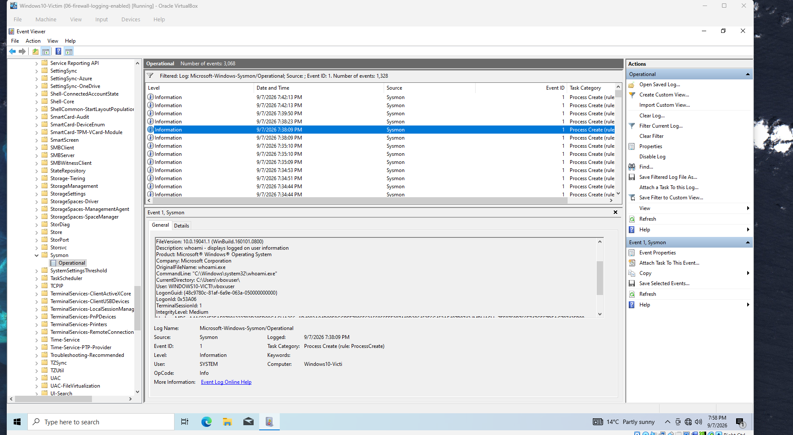

# Project 4: Detect Malicious PowerShell via Script Block Logging (Event ID 4104)

## Scenario

My job was to detect an attacker hiding a malicious PowerShell command. This is hard to detect because when the command is encoded, you wouldn't be able to tell what they did. For instance, in the Sysmon log (Event ID 1) the command line was gibberish and wasn't decoded. To test it, I took the command `whoami`, disguised it as Base64 gibberish, and ran it with `powershell -enc`. I then opened Event Viewer and checked the PowerShell Operational log for Event ID 4104 and read the decoded command, which was `whoami`.

## Findings

In the PowerShell Operational log I found the Event ID 4104 entry for the command, showing the date and time it ran, the source as PowerShell, and in the General tab the decoded command in plain English: `whoami`. The key details were Event ID 4104, the log Microsoft-Windows-PowerShell/Operational, the decoded command `whoami`, and the user WINDOWS10-VICTIM\vboxuser.

When I checked the Sysmon log (Event ID 1) for the same command, the command line only showed the Base64 in its gibberish form, and it was never decoded. Sysmon also captured a `whoami.exe` child process, which only appeared because `whoami` is a separate program that PowerShell had to launch.

That exposes the limit of the process log. If a sneakier attacker ran their command entirely inside PowerShell with no separate program, Sysmon would only capture the encoded command and no child process, so it wouldn't tell you what actually ran. Event ID 4104 is the log I'd rely on, because it captures the decoded command regardless.

## Escalation

I would treat the event as suspicious. First I would check the parent process to see what launched PowerShell. Word (`winword.exe`) or Excel launching PowerShell would be malicious, but Explorer or `cmd` opening PowerShell is normal. I would also check the command line to see if the program runs from `System32`, which is normal, or a different file path, which is suspicious, and correlate the timestamps between the PowerShell and Sysmon logs, matching on the command too since clocks can drift.

To escalate, I would hand over the host, the username, the timestamp, the decoded command from the 4104 log, the parent process, and the file path. I would also check the 4104 log for any commands that followed, since recon like `whoami` is usually the first step. In this case the attacker stopped at `whoami`.
