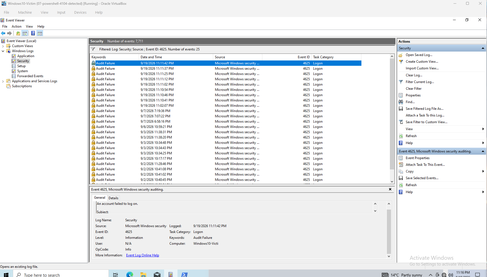
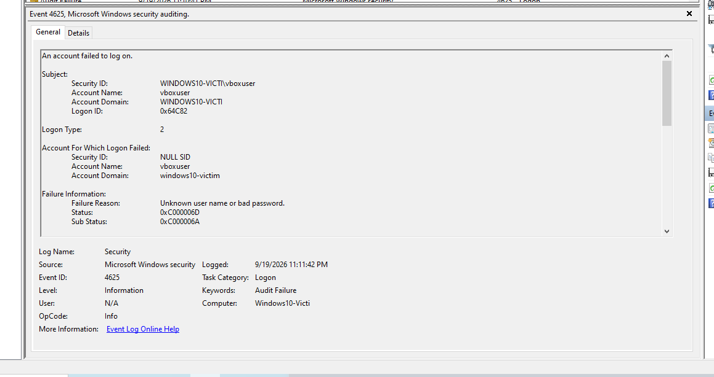
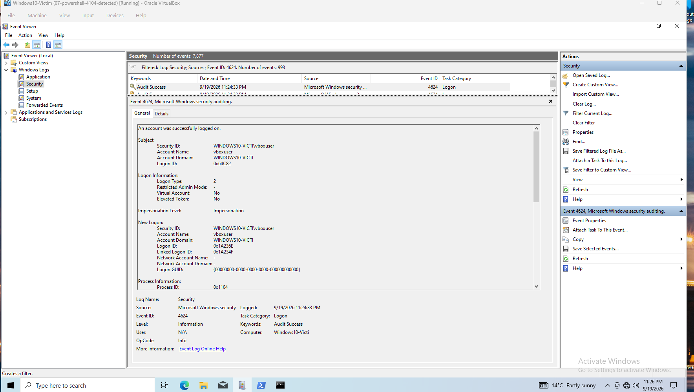

# Project 5 — Detect a Failed-Logon Attack (Event ID 4625 / 4624)

## Scenario
I ran repeated failed logons locally in PowerShell using `runas`, which generated a password prompt each time. I entered wrong passwords to generate failed logons (Event ID 4625) in the Windows Security log. I then ran the command again with the correct password, which opened a cmd window, and found the successful logon (Event ID 4624) in the Security log.

## Findings
In the Security log there were 8 failed logons (4625) within about a minute. Both the failed and successful logons were Logon Type 2 and had the same account name.

In the failure information, the Status `0xC000006D` showed the logon attempt failed, and the Sub Status `0xC000006A` showed the username existed but the password was wrong. From an attacker's perspective, that means they are actively trying to guess a real user's password.

Below the 8 failed logons there were one or two older failures, days apart, from the same user with the same failure reason. What made the burst stand out is that 8 failed logons in the same timeframe shows someone deliberately guessing, while two or three failed logons days apart is normal.

## Escalation
This is high severity but not yet confirmed. I would escalate it as a suspected compromise, with a warning that it's not yet confirmed. I would check the Sysmon process logs after the 4624, which tells me whether it was an attacker or the user, and then call the user to ask.
