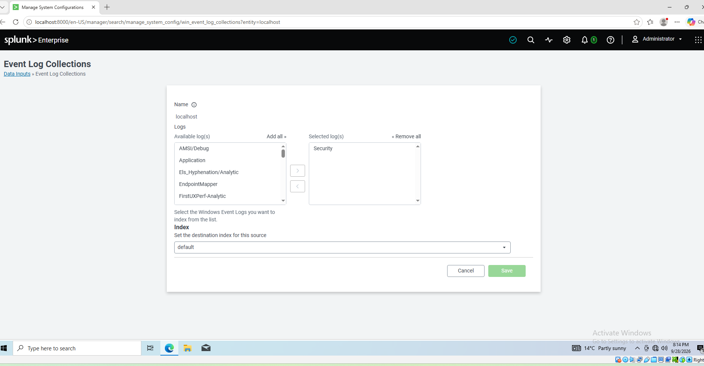
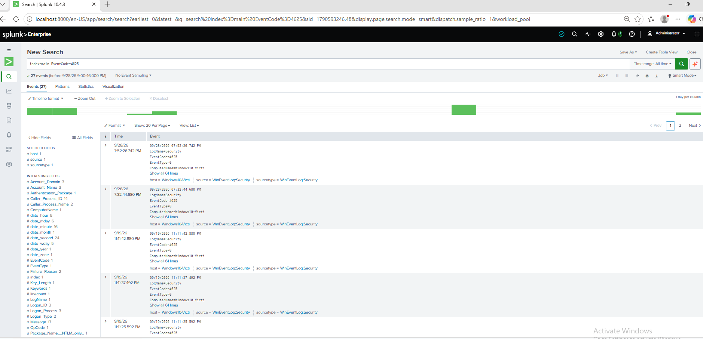
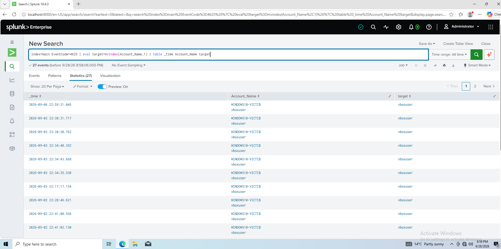
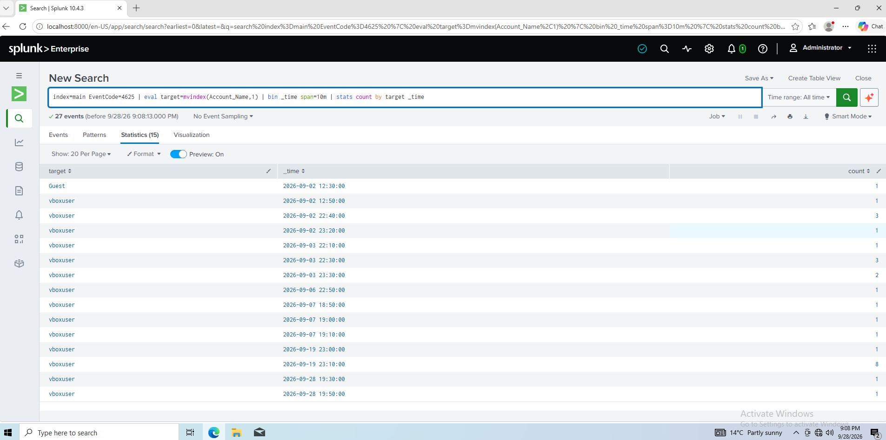
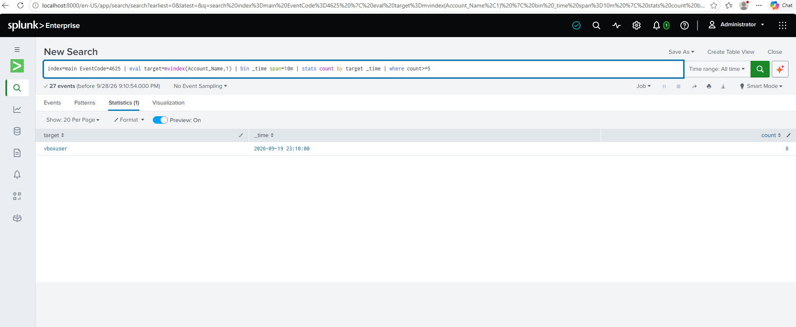
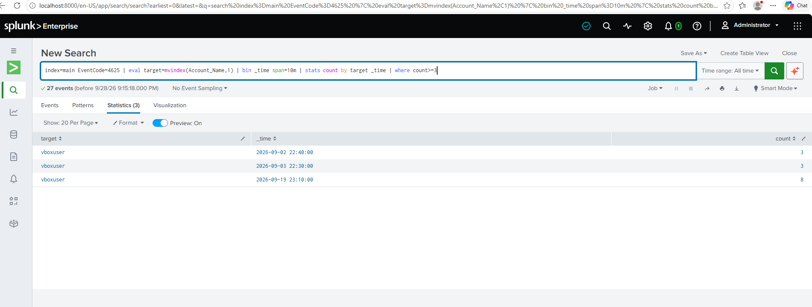
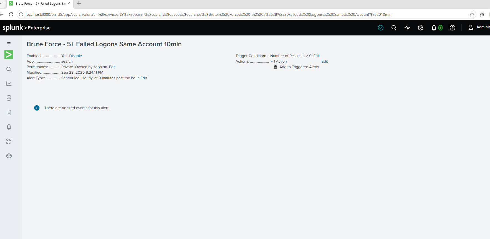

# Project 6: Automatic Detection Rule for Failed Logons (Splunk)

## Scenario
In Projects 3 to 5 I found each attack by reading the logs by hand. In Project 6, Splunk collects the logs in one place and a saved rule raises an alert automatically.

This matters because a real SOC watches thousands of computers. Reading logs by hand would take forever and you'd have to go onto each computer to see its logs, whereas Splunk captures the logs from every computer in one place.

## Setup
- Splunk Enterprise 10.4.3 installed on the isolated Windows 10 VM (installer moved in via a read-only VirtualBox shared folder; the VM never left the internal `soclab` network).
- **Licence:** Splunk Enterprise **Trial** (60 days). Scheduled alerts work on the trial. They would **not** fire on the Splunk Free licence, which has alerting disabled.
- Data input: Local Windows Event Log → **Security** channel only → index `main`.



## Test data
The Project 5 failed-logon burst was already in the Security log: **27 × Event ID 4625** in total.



## Building the rule
Built one piece at a time, running it after each step:

```
index=main EventCode=4625
| eval target=mvindex(Account_Name,1)
| bin _time span=10m
| stats count by target _time
| where count>=5
```

| Piece | What it does |
|---|---|
| `index=main EventCode=4625` | Find every failed logon |
| `eval target=mvindex(Account_Name,1)` | Take the **Account For Which Logon Failed** (the target) out of the two Account Names |
| `bin _time span=10m` | Split time into 10-minute buckets |
| `stats count by target _time` | Count failures per account, per bucket |
| `where count>=5` | Keep only buckets with 5 or more failures |

## Findings

### Why not alert on every 4625?
Most failed logons are just noise, a one-time thing. My own data showed this: 8 failures came within one 10-minute window, while the other failures were at different timestamps, only 1 to 3 at a time. Alerting on all of them leads to **alert fatigue**.

### Why count by the target account, not the Subject?
The target is the account being guessed by the attacker. In my data the Subject changed depending on how the login was attempted: `WINDOWS10-VICTI$` for failures typed at the login screen, `vboxuser` for my Project 5 burst, while the target was `vboxuser` both times. If the rule counted by Subject, one attack could be split across different Subject names, each count could stay under 5, and the attack would be missed.



### Before the threshold
Counting failures per account in 10-minute buckets, before filtering, shows one bucket of 8 standing out from buckets of 1 to 3.



### Result
27 failures went in, **1 result** came out: `vboxuser`, 19/09 at 11:10 PM, **8 failures**. The other 26 failures were correctly ignored.



### Choosing the threshold
- **3:** returned 3 rows: 2 false positives at different timestamps and 1 true positive (the 8 failed logons).
- **10:** higher than the number of attempts, so it returned zero results, so the attack was missed.
- **5:** returned one row of 8 logon attempts, accurately showing only the true positive, with no false positives.



### Unexplained events I checked
- **Guest (02/09, 12:30 PM):** one 4625, Logon Type 3, called by `explorer.exe`, account disabled. I assessed it as not an attack because it happened only once and came from my own session as vboxuser. It was called by explorer.exe, which fits Windows trying the Guest account when browsing a network location.
- **Two failures on 28/09:** me mistyping the VM password.

## Saved alert
Scheduled hourly, triggers when results > 0, action: Add to Triggered Alerts, severity High.



## Escalation
When the alert fires I would check for an Event ID 4624 after the failures to see if the person got in, look at where it came from, and confirm with the user whether it was them. I'd escalate if there's a success I can't explain.

## Limitations
- I only tested the threshold on one computer. A company has many computers, and 5 failures could just be one person trying to reset their password and failing to log on. That would be a false positive. The threshold would need testing on the company's own data.
- My rule wouldn't catch a **password spray**, because each account only gets one attempt, which never reaches the threshold of 5. To catch it, I'd count how many different accounts one IP tried to log into within 10 minutes.
- The rule uses fixed 10-minute buckets, so an attack split across two buckets could be missed. A **sliding window** would trigger even if it's split, as long as it's within 10 minutes.
- The test data is the **simulated** log pattern from Project 5 (local `runas`, Logon Type 2), not a real brute-force tool.
- Built on the Enterprise Trial licence; on Splunk Free the alert would not fire.
# Project 6: Automatic Detection Rule for Failed Logons (Splunk)

## Scenario
In Projects 3 to 5 I found each attack by reading the logs by hand. In Project 6, Splunk collects the logs in one place and a saved rule raises an alert automatically.

This matters because a real SOC watches thousands of computers. Reading logs by hand would take forever and you'd have to go onto each computer to see its logs, whereas Splunk captures the logs from every computer in one place.

## Setup
- Splunk Enterprise 10.4.3 installed on the isolated Windows 10 VM (installer moved in via a read-only VirtualBox shared folder; the VM never left the internal `soclab` network).
- **Licence:** Splunk Enterprise **Trial** (60 days). Scheduled alerts work on the trial. They would **not** fire on the Splunk Free licence, which has alerting disabled.
- Data input: Local Windows Event Log → **Security** channel only → index `main`.


## Test data
The Project 5 failed-logon burst was already in the Security log: **27 × Event ID 4625** in total.


## Building the rule
Built one piece at a time, running it after each step:

```
index=main EventCode=4625
| eval target=mvindex(Account_Name,1)
| bin _time span=10m
| stats count by target _time
| where count>=5
```

| Piece | What it does |
|---|---|
| `index=main EventCode=4625` | Find every failed logon |
| `eval target=mvindex(Account_Name,1)` | Take the **Account For Which Logon Failed** (the target) out of the two Account Names |
| `bin _time span=10m` | Split time into 10-minute buckets |
| `stats count by target _time` | Count failures per account, per bucket |
| `where count>=5` | Keep only buckets with 5 or more failures |

## Findings

### Why not alert on every 4625?
Most failed logons are just noise, a one-time thing. My own data showed this: 8 failures came within one 10-minute window, while the other failures were at different timestamps, only 1 to 3 at a time. Alerting on all of them leads to **alert fatigue**.

### Why count by the target account, not the Subject?
The target is the account being guessed by the attacker. In my data the Subject changed depending on how the login was attempted: `WINDOWS10-VICTI$` for failures typed at the login screen, `vboxuser` for my Project 5 burst, while the target was `vboxuser` both times. If the rule counted by Subject, one attack could be split across different Subject names, each count could stay under 5, and the attack would be missed.


### Before the threshold
Counting failures per account in 10-minute buckets, before filtering, shows one bucket of 8 standing out from buckets of 1 to 3.


### Result
27 failures went in, **1 result** came out: `vboxuser`, 19/09 at 11:10 PM, **8 failures**. The other 26 failures were correctly ignored.


### Choosing the threshold
- **3:** returned 3 rows: 2 false positives at different timestamps and 1 true positive (the 8 failed logons).
- **10:** higher than the number of attempts, so it returned zero results, so the attack was missed.
- **5:** returned one row of 8 logon attempts, accurately showing only the true positive, with no false positives.


### Unexplained events I checked
- **Guest (02/09, 12:30 PM):** one 4625, Logon Type 3, called by `explorer.exe`, account disabled. I assessed it as not an attack because it happened only once and came from my own session as vboxuser. It was called by explorer.exe, which fits Windows trying the Guest account when browsing a network location.
- **Two failures on 28/09:** me mistyping the VM password.

## Saved alert
Scheduled hourly, triggers when results > 0, action: Add to Triggered Alerts, severity High.


## Escalation
When the alert fires I would check for an Event ID 4624 after the failures to see if the person got in, look at where it came from, and confirm with the user whether it was them. I'd escalate if there's a success I can't explain.

## Limitations
- I only tested the threshold on one computer. A company has many computers, and 5 failures could just be one person trying to reset their password and failing to log on. That would be a false positive. The threshold would need testing on the company's own data.
- My rule wouldn't catch a **password spray**, because each account only gets one attempt, which never reaches the threshold of 5. To catch it, I'd count how many different accounts one IP tried to log into within 10 minutes.
- The rule uses fixed 10-minute buckets, so an attack split across two buckets could be missed. A **sliding window** would trigger even if it's split, as long as it's within 10 minutes.
- The test data is the **simulated** log pattern from Project 5 (local `runas`, Logon Type 2), not a real brute-force tool.
- Built on the Enterprise Trial licence; on Splunk Free the alert would not fire.
